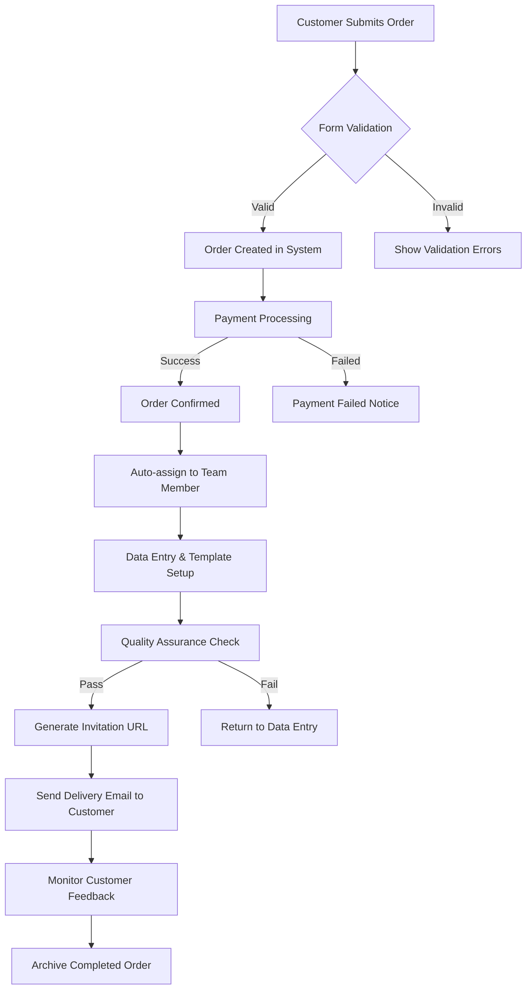

# Analisis Kebutuhan Platform Admin Dashboard Berakad.site

## 📋 Executive Summary

Platform Berakad.site adalah layanan pembuatan undangan digital yang memungkinkan satu template digunakan oleh banyak user dengan informasi berbeda. Dashboard admin merupakan sistem manajemen terpusat untuk mengontrol template, user, data undangan, dan operasional bisnis secara real-time.

### 🎯 Tujuan Utama Platform:
- **Template Reusability**: Satu template dapat digunakan berkali-kali dengan data user berbeda
- **User Management**: Kelola informasi user dan undangan mereka
- **Content Management**: Manajemen template, media, dan konten dinamis
- **Business Operations**: Monitor performa, analitik, dan operasional bisnis

---

## 🏗️ Analisis Arsitektur Sistem

### 1. Core System Architecture

```
┌─────────────────────────────────────────────────────────────┐
│                    ADMIN DASHBOARD                          │
├─────────────────────────────────────────────────────────────┤
│  Template Manager │ User Manager │ Content Manager │ Analytics│
└─────────────────────────────────────────────────────────────┘
                                │
                                ▼
┌─────────────────────────────────────────────────────────────┐
│                      API LAYER                              │
├─────────────────────────────────────────────────────────────┤
│    Template API   │   User API   │   Media API   │  Data API │
└─────────────────────────────────────────────────────────────┘
                                │
                                ▼
┌─────────────────────────────────────────────────────────────┐
│                    DATABASE LAYER                           │
├─────────────────────────────────────────────────────────────┤
│  Templates │ Users │ Invitations │ Media │ Analytics │ Config│
└─────────────────────────────────────────────────────────────┘
                                │
                                ▼
┌─────────────────────────────────────────────────────────────┐
│                   FRONTEND LAYER                            │
├─────────────────────────────────────────────────────────────┤
│   Public Site    │  User Portal  │  Live Invitations       │
└─────────────────────────────────────────────────────────────┘
```

### 2. Template System Design

#### Berdasarkan Analisis Template Existing:

**Kategori Template yang Ditemukan:**
1. **Pernikahan** (38 template)
   - Elegant/Classic (template_1, template_37, template_34)
   - Modern/Minimalist (template_11, template_13)
   - Garden/Nature (template_12, template_30)
   - Vintage/Cultural (template_7, template_20, template_28)
   - Creative/Themed (template_5, template_26, template_32)

2. **Tunangan** (20 template)
   - Romantic themes
   - Engagement-specific layouts
   - Formal/Traditional styles

3. **Ulang Tahun** (40+ template)
   - Kids themes
   - Adult celebrations
   - Creative/artistic themes

---

## 🗄️ Database Schema Design

### 1. Core Tables

```sql
-- Users Table
CREATE TABLE users (
    id BIGINT PRIMARY KEY AUTO_INCREMENT,
    user_id VARCHAR(36) UNIQUE NOT NULL,
    name VARCHAR(255) NOT NULL,
    email VARCHAR(255) UNIQUE NOT NULL,
    phone VARCHAR(20),
    user_type ENUM('customer', 'admin', 'super_admin') DEFAULT 'customer',
    subscription_tier ENUM('simple', 'plus', 'vip') DEFAULT 'simple',
    status ENUM('active', 'inactive', 'suspended') DEFAULT 'active',
    created_at TIMESTAMP DEFAULT CURRENT_TIMESTAMP,
    updated_at TIMESTAMP DEFAULT CURRENT_TIMESTAMP ON UPDATE CURRENT_TIMESTAMP,
    last_login TIMESTAMP NULL,
    
    INDEX idx_user_id (user_id),
    INDEX idx_email (email),
    INDEX idx_status (status),
    INDEX idx_created_at (created_at)
);

-- Templates Table
CREATE TABLE templates (
    id BIGINT PRIMARY KEY AUTO_INCREMENT,
    template_id VARCHAR(36) UNIQUE NOT NULL,
    name VARCHAR(255) NOT NULL,
    category ENUM('wedding', 'engagement', 'birthday', 'anniversary', 'other') NOT NULL,
    subcategory VARCHAR(100),
    html_file VARCHAR(255) NOT NULL,
    preview_image VARCHAR(255),
    thumbnail VARCHAR(255),
    description TEXT,
    features JSON, -- RSVP, Maps, Gallery, etc.
    theme_data JSON, -- Colors, fonts, styles
    status ENUM('active', 'inactive', 'draft') DEFAULT 'draft',
    is_premium BOOLEAN DEFAULT FALSE,
    sort_order INT DEFAULT 0,
    usage_count INT DEFAULT 0,
    created_at TIMESTAMP DEFAULT CURRENT_TIMESTAMP,
    updated_at TIMESTAMP DEFAULT CURRENT_TIMESTAMP ON UPDATE CURRENT_TIMESTAMP,
    
    INDEX idx_template_id (template_id),
    INDEX idx_category (category),
    INDEX idx_status (status),
    INDEX idx_is_premium (is_premium)
);

-- User Invitations Table (Core functionality)
CREATE TABLE user_invitations (
    id BIGINT PRIMARY KEY AUTO_INCREMENT,
    invitation_id VARCHAR(36) UNIQUE NOT NULL,
    user_id VARCHAR(36) NOT NULL,
    template_id VARCHAR(36) NOT NULL,
    invitation_data JSON NOT NULL, -- All custom data
    custom_url VARCHAR(255) UNIQUE,
    password VARCHAR(255) NULL,
    status ENUM('active', 'inactive', 'expired') DEFAULT 'active',
    expires_at TIMESTAMP NULL,
    view_count INT DEFAULT 0,
    rsvp_count INT DEFAULT 0,
    created_at TIMESTAMP DEFAULT CURRENT_TIMESTAMP,
    updated_at TIMESTAMP DEFAULT CURRENT_TIMESTAMP ON UPDATE CURRENT_TIMESTAMP,
    
    FOREIGN KEY (user_id) REFERENCES users(user_id) ON DELETE CASCADE,
    FOREIGN KEY (template_id) REFERENCES templates(template_id) ON DELETE RESTRICT,
    
    INDEX idx_invitation_id (invitation_id),
    INDEX idx_user_id (user_id),
    INDEX idx_template_id (template_id),
    INDEX idx_custom_url (custom_url),
    INDEX idx_status (status),
    INDEX idx_created_at (created_at)
);

-- RSVP Responses Table
CREATE TABLE rsvp_responses (
    id BIGINT PRIMARY KEY AUTO_INCREMENT,
    response_id VARCHAR(36) UNIQUE NOT NULL,
    invitation_id VARCHAR(36) NOT NULL,
    guest_name VARCHAR(255) NOT NULL,
    guest_email VARCHAR(255),
    guest_phone VARCHAR(20),
    attendance ENUM('yes', 'no', 'maybe') NOT NULL,
    guest_count INT DEFAULT 1,
    message TEXT,
    dietary_requirements TEXT,
    created_at TIMESTAMP DEFAULT CURRENT_TIMESTAMP,
    
    FOREIGN KEY (invitation_id) REFERENCES user_invitations(invitation_id) ON DELETE CASCADE,
    
    INDEX idx_response_id (response_id),
    INDEX idx_invitation_id (invitation_id),
    INDEX idx_attendance (attendance),
    INDEX idx_created_at (created_at)
);

-- Template Analytics Table
CREATE TABLE template_analytics (
    id BIGINT PRIMARY KEY AUTO_INCREMENT,
    template_id VARCHAR(36) NOT NULL,
    metric_type ENUM('view', 'selection', 'completion', 'share') NOT NULL,
    metric_value INT DEFAULT 1,
    user_id VARCHAR(36) NULL,
    session_id VARCHAR(64),
    ip_address VARCHAR(45),
    user_agent TEXT,
    referrer VARCHAR(255),
    recorded_at TIMESTAMP DEFAULT CURRENT_TIMESTAMP,
    
    FOREIGN KEY (template_id) REFERENCES templates(template_id) ON DELETE CASCADE,
    
    INDEX idx_template_id (template_id),
    INDEX idx_metric_type (metric_type),
    INDEX idx_recorded_at (recorded_at),
    INDEX idx_user_id (user_id)
);

-- Media Library Table
CREATE TABLE media_library (
    id BIGINT PRIMARY KEY AUTO_INCREMENT,
    media_id VARCHAR(36) UNIQUE NOT NULL,
    filename VARCHAR(255) NOT NULL,
    original_name VARCHAR(255) NOT NULL,
    file_path VARCHAR(500) NOT NULL,
    file_size BIGINT NOT NULL,
    mime_type VARCHAR(100) NOT NULL,
    media_type ENUM('image', 'video', 'audio', 'document') NOT NULL,
    dimensions VARCHAR(20), -- For images: 1920x1080
    uploaded_by VARCHAR(36),
    tags JSON,
    alt_text VARCHAR(255),
    is_public BOOLEAN DEFAULT FALSE,
    usage_count INT DEFAULT 0,
    created_at TIMESTAMP DEFAULT CURRENT_TIMESTAMP,
    
    INDEX idx_media_id (media_id),
    INDEX idx_media_type (media_type),
    INDEX idx_uploaded_by (uploaded_by),
    INDEX idx_is_public (is_public)
);
```

### 2. JSON Schema untuk invitation_data

```json
{
  "couple": {
    "bride": {
      "fullName": "string",
      "nickname": "string",
      "fatherName": "string",
      "motherName": "string",
      "photo": "string",
      "socialMedia": {
        "instagram": "string",
        "facebook": "string"
      }
    },
    "groom": {
      "fullName": "string",
      "nickname": "string", 
      "fatherName": "string",
      "motherName": "string",
      "photo": "string",
      "socialMedia": {
        "instagram": "string",
        "facebook": "string"
      }
    }
  },
  "events": [
    {
      "type": "akad|resepsi|engagement|birthday",
      "title": "string",
      "date": "YYYY-MM-DD",
      "time": "HH:MM",
      "endTime": "HH:MM",
      "venue": {
        "name": "string",
        "address": "string",
        "googleMapsUrl": "string",
        "coordinates": {
          "lat": "number",
          "lng": "number"
        }
      },
      "dresscode": "string",
      "notes": "string"
    }
  ],
  "content": {
    "coverText": "string",
    "openingQuote": "string",
    "closingMessage": "string",
    "loveStory": [
      {
        "title": "string",
        "date": "string",
        "description": "string"
      }
    ],
    "gallery": [
      {
        "url": "string",
        "caption": "string",
        "type": "photo|video"
      }
    ],
    "music": {
      "url": "string",
      "title": "string",
      "artist": "string",
      "autoplay": "boolean"
    }
  },
  "features": {
    "rsvp": {
      "enabled": "boolean",
      "maxGuests": "number",
      "fields": ["name", "email", "phone", "message", "dietary"]
    },
    "giftWishes": {
      "enabled": "boolean",
      "accounts": [
        {
          "bank": "string",
          "accountNumber": "string",
          "accountName": "string"
        }
      ]
    },
    "countdown": {
      "enabled": "boolean",
      "targetDate": "YYYY-MM-DD HH:MM:SS"
    },
    "guestBook": {
      "enabled": "boolean",
      "moderated": "boolean"
    }
  },
  "theme": {
    "primaryColor": "string",
    "secondaryColor": "string",
    "fontFamily": "string",
    "backgroundImage": "string",
    "customCss": "string"
  },
  "settings": {
    "privacy": "public|private|password",
    "allowComments": "boolean",
    "showGuestCount": "boolean",
    "enableAnalytics": "boolean"
  }
}
```

---

## 🎛️ Dashboard Admin - Functional Requirements

### 1. Template Management System

#### A. Template Library Manager
```
┌─────────────────────────────────────────────────────────┐
│ TEMPLATE LIBRARY MANAGER                                │
├─────────────────────────────────────────────────────────┤
│ ┌─────────────┐ ┌─────────────┐ ┌─────────────┐         │
│ │ Upload New  │ │ Edit Exist. │ │ Preview All │         │
│ │ Template    │ │ Template    │ │ Templates   │         │
│ └─────────────┘ └─────────────┘ └─────────────┘         │
├─────────────────────────────────────────────────────────┤
│ Features:                                               │
│ • Bulk upload HTML templates                            │
│ • Visual template editor dengan live preview            │
│ • Category/subcategory management                       │
│ • Template versioning & rollback                        │
│ • Feature flags (RSVP, Maps, Gallery, dll)             │
│ • A/B testing untuk template                            │
│ • Template analytics & performance metrics              │
│ • Automatic screenshot generation                       │
│ • SEO optimization untuk template                       │
└─────────────────────────────────────────────────────────┘
```

**Key Features:**
- **Visual Template Editor**: Drag-drop editor untuk customize template
- **Dynamic Data Binding**: System untuk mapping data user ke template
- **Template Inheritance**: Base template dengan variant themes
- **Responsive Preview**: Preview template di desktop, tablet, mobile
- **Template Performance**: Monitor loading speed dan user engagement

#### B. Template Analytics Dashboard
```
Template Performance Metrics:
┌─────────────────┬─────────────────┬─────────────────┐
│ Template Views  │ Selection Rate  │ Completion Rate │
│ 📊 Real-time    │ 📈 Trending     │ ✅ Success Rate │
├─────────────────┼─────────────────┼─────────────────┤
│ • Daily views   │ • Click-through │ • Order completion│
│ • Unique users  │ • Category perf │ • User feedback │ 
│ • Bounce rate   │ • Popular themes│ • Revenue per   │
│ • Avg time      │ • Seasonal      │   template      │
└─────────────────┴─────────────────┴─────────────────┘
```

### 2. User Management System

#### A. Customer Relationship Manager
```
┌─────────────────────────────────────────────────────────┐
│ USER MANAGEMENT DASHBOARD                               │
├─────────────────────────────────────────────────────────┤
│ User Overview:                                          │
│ • Total Users: 1,234 (+15% this month)                 │
│ • Active Users: 987 (last 30 days)                     │
│ • New Signups: 45 (this week)                          │
│ • Premium Users: 234 (18.9% conversion)                │
├─────────────────────────────────────────────────────────┤
│ Quick Actions:                                          │
│ [Search Users] [Add User] [Bulk Export] [Send Email]   │
├─────────────────────────────────────────────────────────┤
│ User Segments:                                          │
│ • First-time buyers: 456 users                         │
│ • Repeat customers: 123 users                          │
│ • High-value customers: 45 users                       │
│ • Inactive users: 234 users                            │
└─────────────────────────────────────────────────────────┘
```

**Key Features:**
- **User Lifecycle Management**: Track user journey dari landing hingga conversion
- **Automated Communications**: Email sequences untuk onboarding, follow-up
- **Customer Support Integration**: Live chat, ticket system, knowledge base
- **User Behavior Analytics**: Heatmaps, user flows, conversion funnels
- **Retention Campaigns**: Win-back campaigns untuk inactive users

#### B. Invitation Management
```
┌─────────────────────────────────────────────────────────┐
│ INVITATION MANAGEMENT DASHBOARD                         │
├─────────────────────────────────────────────────────────┤
│ Live Invitations: 456 active | 123 expired             │
│                                                         │
│ ┌─────────────┐ ┌─────────────┐ ┌─────────────┐         │
│ │Recent Orders│ │ Pending     │ │ Live        │         │
│ │    📝       │ │ Review 🔍   │ │ Invitations │         │
│ │    25       │ │     8       │ │    456 📊   │         │
│ └─────────────┘ └─────────────┘ └─────────────┘         │
├─────────────────────────────────────────────────────────┤
│ Invitation Details View:                                │
│ • User info & contact details                          │
│ • Template used & customization                        │
│ • RSVP responses & guest list                          │
│ • View analytics (visits, shares, engagement)          │
│ • Revenue & payment status                             │
│ • Support tickets & communication history              │
└─────────────────────────────────────────────────────────┘
```

### 3. Content Management System

#### A. Media Library Manager
```
┌─────────────────────────────────────────────────────────┐
│ MEDIA LIBRARY DASHBOARD                                 │
├─────────────────────────────────────────────────────────┤
│ Storage: 2.4 GB used / 10 GB limit                     │
│                                                         │
│ ┌─────────────┐ ┌─────────────┐ ┌─────────────┐         │
│ │ Images      │ │ Videos      │ │ Audio       │         │
│ │ 🖼️ 1,234   │ │ 🎥 45       │ │ 🎵 67      │         │
│ └─────────────┘ └─────────────┘ └─────────────┘         │
├─────────────────────────────────────────────────────────┤
│ Features:                                               │
│ • Drag & drop bulk upload                              │
│ • Automatic image optimization & compression           │
│ • CDN integration untuk fast delivery                  │
│ • Image editing tools (crop, resize, filters)          │
│ • Folder organization & tagging system                 │
│ • Usage tracking & duplicate detection                 │
│ • Automatic backup & version control                   │
└─────────────────────────────────────────────────────────┘
```

#### B. Dynamic Content Manager
```
┌─────────────────────────────────────────────────────────┐
│ DYNAMIC CONTENT MANAGER                                 │
├─────────────────────────────────────────────────────────┤
│ Content Templates:                                      │
│ • Opening quotes library (125 items)                   │
│ • Closing messages templates (89 items)                │
│ • Love story templates (45 variations)                 │
│ • Cultural/religious text variations                   │
├─────────────────────────────────────────────────────────┤
│ AI Content Generator:                                   │
│ • Auto-generate personalized quotes                    │
│ • Suggest content based on template theme              │
│ • Multi-language content generation                    │
│ • Sentiment analysis untuk content appropriateness     │
└─────────────────────────────────────────────────────────┘
```

### 4. Business Operations Dashboard

#### A. Revenue & Analytics
```
┌─────────────────────────────────────────────────────────┐
│ REVENUE DASHBOARD                                       │
├─────────────────────────────────────────────────────────┤
│ This Month: Rp 15,670,000 (+23% vs last month)         │
│                                                         │
│ ┌─────────────┐ ┌─────────────┐ ┌─────────────┐         │
│ │ Simple Plan │ │ Plus Plan   │ │ VIP Plan    │         │
│ │ Rp 25k x 234│ │ Rp 75k x 89 │ │ Rp 150k x 45│         │
│ │ = 5.85M     │ │ = 6.675M    │ │ = 6.75M     │         │
│ └─────────────┘ └─────────────┘ └─────────────┘         │
├─────────────────────────────────────────────────────────┤
│ Key Metrics:                                            │
│ • Average Order Value: Rp 67,500                       │
│ • Monthly Recurring Revenue: Rp 8,450,000              │
│ • Customer Acquisition Cost: Rp 35,000                 │
│ • Customer Lifetime Value: Rp 189,000                  │
│ • Churn Rate: 12% monthly                              │
└─────────────────────────────────────────────────────────┘
```

#### B. Order Management System
```
┌─────────────────────────────────────────────────────────┐
│ ORDER MANAGEMENT WORKFLOW                               │
├─────────────────────────────────────────────────────────┤
│ New Order → Data Review → Template Setup → QA → Delivery│
│     📥           🔍           ⚙️          ✅      📧   │
├─────────────────────────────────────────────────────────┤
│ Automation Rules:                                       │
│ • Auto-assign orders by template complexity             │
│ • Escalate orders pending > 4 hours                    │
│ • Send customer updates at each stage                  │
│ • Auto-generate delivery emails                        │
│ • Schedule follow-up surveys                           │
├─────────────────────────────────────────────────────────┤
│ Quality Assurance Checklist:                           │
│ ☑️ Template data mapping correct                       │
│ ☑️ All images loading properly                         │
│ ☑️ RSVP functionality working                          │
│ ☑️ Mobile responsiveness verified                      │
│ ☑️ Links & contact info validated                      │
│ ☑️ Spelling & grammar checked                          │
└─────────────────────────────────────────────────────────┘
```

---

## 🔧 Technical Implementation

### 1. Frontend Architecture

#### Dashboard Tech Stack:
```
Frontend Framework: Vue.js 3 + TypeScript
├── State Management: Pinia
├── UI Framework: Tailwind CSS + Headless UI
├── Charts & Analytics: Chart.js / D3.js
├── File Upload: Vue File Pond
├── Rich Text Editor: TinyMCE / QuillJS
├── Date/Time: Day.js
├── HTTP Client: Axios
└── Build Tool: Vite
```

#### Component Structure:
```
src/
├── components/
│   ├── common/           # Reusable UI components
│   ├── template/         # Template management
│   ├── user/            # User management
│   ├── media/           # Media library
│   ├── analytics/       # Charts & reporting
│   └── layout/          # Layout components
├── views/
│   ├── Dashboard.vue    # Main dashboard
│   ├── Templates/       # Template management pages
│   ├── Users/          # User management pages
│   ├── Orders/         # Order management pages
│   └── Settings/       # System settings
├── stores/             # Pinia stores
├── services/           # API services
├── utils/              # Helper functions
└── types/              # TypeScript definitions
```

### 2. Backend Architecture

#### API Design Pattern:
```
RESTful API + GraphQL for complex queries
├── Authentication: JWT + Refresh Tokens
├── Authorization: Role-based access control (RBAC)
├── Rate Limiting: Redis-based throttling
├── Caching: Redis for frequent queries
├── File Storage: AWS S3 / DigitalOcean Spaces
├── Database: MySQL 8.0 with read replicas
├── Search: Elasticsearch for advanced search
└── Queue: Redis Queue for async processing
```

#### Core API Endpoints:
```
Authentication:
POST /api/auth/login
POST /api/auth/refresh
POST /api/auth/logout

Template Management:
GET    /api/templates              # List all templates
POST   /api/templates              # Create new template
GET    /api/templates/{id}         # Get template details
PUT    /api/templates/{id}         # Update template
DELETE /api/templates/{id}         # Delete template
POST   /api/templates/{id}/duplicate # Duplicate template
GET    /api/templates/{id}/analytics # Template analytics

User Management:
GET    /api/users                  # List users with filters
POST   /api/users                  # Create user
GET    /api/users/{id}             # Get user details
PUT    /api/users/{id}             # Update user
DELETE /api/users/{id}             # Delete user
GET    /api/users/{id}/invitations # User's invitations

Invitation Management:
GET    /api/invitations            # List all invitations
POST   /api/invitations            # Create invitation
GET    /api/invitations/{id}       # Get invitation details
PUT    /api/invitations/{id}       # Update invitation
DELETE /api/invitations/{id}       # Delete invitation
GET    /api/invitations/{id}/rsvp  # Get RSVP responses
POST   /api/invitations/{id}/render # Render invitation HTML

Analytics:
GET    /api/analytics/overview     # Dashboard overview
GET    /api/analytics/templates    # Template performance
GET    /api/analytics/users        # User behavior
GET    /api/analytics/revenue      # Revenue analytics
```

### 3. Database Optimization

#### Indexing Strategy:
```sql
-- Composite indexes for common queries
CREATE INDEX idx_invitations_user_status ON user_invitations(user_id, status);
CREATE INDEX idx_invitations_template_created ON user_invitations(template_id, created_at);
CREATE INDEX idx_analytics_template_date ON template_analytics(template_id, recorded_at);
CREATE INDEX idx_rsvp_invitation_attendance ON rsvp_responses(invitation_id, attendance);

-- Full-text search indexes
CREATE FULLTEXT INDEX idx_templates_search ON templates(name, description);
CREATE FULLTEXT INDEX idx_users_search ON users(name, email);
```

#### Caching Strategy:
```
Redis Cache Layers:
├── Session Storage (TTL: 24 hours)
├── Template Cache (TTL: 6 hours)
├── User Profile Cache (TTL: 1 hour)
├── Analytics Cache (TTL: 30 minutes)
└── Media URL Cache (TTL: 7 days)
```

---

## 🎨 User Interface Design

### 1. Dashboard Layout

#### Main Navigation:
```
┌─────────────────────────────────────────────────────────┐
│ [🏠 Berakad.site] [🔔] [👤 Admin] [⚙️] [🚪 Logout]     │
├─────────────────────────────────────────────────────────┤
│ ┌─────────────┐ ┌───────────────────────────────────────┐│
│ │ SIDEBAR     │ │ MAIN CONTENT AREA                     ││
│ │             │ │                                       ││
│ │ 📊 Dashboard │ │ ┌─────────────────────────────────┐   ││
│ │ 📄 Templates │ │ │                                 │   ││
│ │ 👥 Users     │ │ │         DYNAMIC CONTENT         │   ││
│ │ 📝 Orders    │ │ │                                 │   ││
│ │ 🖼️ Media     │ │ │                                 │   ││
│ │ 📈 Analytics │ │ │                                 │   ││
│ │ ⚙️ Settings  │ │ │                                 │   ││
│ │             │ │ └─────────────────────────────────────┘   ││
│ └─────────────┘ └───────────────────────────────────────┘│
└─────────────────────────────────────────────────────────┘
```

### 2. Template Management Interface

#### Template Editor:
```
┌─────────────────────────────────────────────────────────┐
│ Template Editor: Wedding Elegant Classic               │
├─────────────────────────────────────────────────────────┤
│ ┌─────────────┐ ┌─────────────────────────────────────┐ │
│ │ PROPERTIES  │ │ LIVE PREVIEW                        │ │
│ │             │ │                                     │ │
│ │ Basic Info  │ │ ┌─────────────────────────────────┐ │ │
│ │ • Name      │ │ │                                 │ │ │
│ │ • Category  │ │ │     TEMPLATE PREVIEW           │ │ │
│ │ • Premium   │ │ │                                 │ │ │
│ │             │ │ │     [Sample Data Rendered]     │ │ │
│ │ Features    │ │ │                                 │ │ │
│ │ ☑️ RSVP     │ │ │                                 │ │ │
│ │ ☑️ Gallery  │ │ │                                 │ │ │
│ │ ☑️ Maps     │ │ │                                 │ │ │
│ │ ☑️ Music    │ │ │                                 │ │ │
│ │             │ │ └─────────────────────────────────┘ │ │
│ │ Theme       │ │                                     │ │
│ │ • Colors    │ │ [💻 Desktop] [📱 Mobile] [🖨️ Print] │ │
│ │ • Fonts     │ │                                     │ │
│ │ • Styles    │ │                                     │ │
│ └─────────────┘ └─────────────────────────────────────┘ │
├─────────────────────────────────────────────────────────┤
│ [💾 Save] [👁️ Preview] [🚀 Publish] [📊 Analytics]      │
└─────────────────────────────────────────────────────────┘
```

### 3. Real-time Dashboard Widgets

```
┌─────────────────────────────────────────────────────────┐
│ REAL-TIME DASHBOARD OVERVIEW                            │
├─────────────────────────────────────────────────────────┤
│ ┌─────────────┐ ┌─────────────┐ ┌─────────────┐         │
│ │ Today       │ │ This Week   │ │ This Month  │         │
│ │ 🎯 23 Orders│ │ 📈 156 Orders│ │ 💰 Rp 12.5M │         │
│ │ ⏱️ 2.3h avg │ │ 🔄 89% Done │ │ 📊 +23% ↗️  │         │
│ └─────────────┘ └─────────────┘ └─────────────┘         │
├─────────────────────────────────────────────────────────┤
│ ┌─────────────────────────────────────────────────────┐ │
│ │ RECENT ACTIVITY FEED                                │ │
│ │ • 14:23 - New order: Wedding Template #37         │ │
│ │ • 14:18 - Template published: Birthday Creative    │ │
│ │ • 14:15 - User registered: maria@email.com        │ │
│ │ • 14:12 - RSVP submitted: 15 guests confirmed     │ │
│ │ • 14:08 - Payment received: Rp 150,000           │ │
│ └─────────────────────────────────────────────────────┘ │
├─────────────────────────────────────────────────────────┤
│ ┌─────────────────────────────────────────────────────┐ │
│ │ TEMPLATE PERFORMANCE (Top 5)                       │ │
│ │ 1. Wedding Elegant Classic    📊 45 orders         │ │
│ │ 2. Birthday Kids Creative     📊 32 orders         │ │
│ │ 3. Engagement Garden          📊 28 orders         │ │
│ │ 4. Anniversary Romantic       📊 21 orders         │ │
│ │ 5. Wedding Modern Minimalist 📊 19 orders         │ │
│ └─────────────────────────────────────────────────────┘ │
└─────────────────────────────────────────────────────────┘
```

---

## 🔄 Workflow & Business Processes

### 1. Order Processing Workflow



### 2. Template Lifecycle Management

```
Template Development Stages:
┌─────────────────────────────────────────────────────────┐
│ 1. DESIGN PHASE                                         │
│    • Market research & trend analysis                   │
│    • Design mockups & wireframes                       │
│    • User testing & feedback collection                │
├─────────────────────────────────────────────────────────┤
│ 2. DEVELOPMENT PHASE                                    │
│    • HTML/CSS coding                                   │
│    • Responsive design implementation                  │
│    • Feature integration (RSVP, Maps, etc.)           │
│    • Cross-browser testing                             │
├─────────────────────────────────────────────────────────┤
│ 3. TESTING PHASE                                       │
│    • Admin preview & review                           │
│    • Sample data testing                              │
│    • Performance optimization                         │
│    • SEO optimization                                 │
├─────────────────────────────────────────────────────────┤
│ 4. LAUNCH PHASE                                        │
│    • Publish to template library                      │
│    • Marketing campaign setup                         │
│    • Customer feedback monitoring                     │
│    • Performance analytics tracking                   │
├─────────────────────────────────────────────────────────┤
│ 5. MAINTENANCE PHASE                                   │
│    • Regular updates & improvements                   │
│    • Bug fixes & optimization                         │
│    • Feature additions based on feedback              │
│    • Version control & rollback capability            │
└─────────────────────────────────────────────────────────┘
```

### 3. Customer Support Integration

```
┌─────────────────────────────────────────────────────────┐
│ CUSTOMER SUPPORT DASHBOARD                              │
├─────────────────────────────────────────────────────────┤
│ Active Tickets: 12 | Avg Response: 45 min              │
│                                                         │
│ ┌─────────────┐ ┌─────────────┐ ┌─────────────┐         │
│ │ New Tickets │ │ In Progress │ │ Resolved    │         │
│ │     🔴 5    │ │    🟡 4     │ │   ✅ 127   │         │
│ └─────────────┘ └─────────────┘ └─────────────┘         │
├─────────────────────────────────────────────────────────┤
│ Integration Features:                                   │
│ • Live chat widget integration                         │
│ • Automatic ticket creation from form issues           │
│ • Customer order history in support context            │
│ • Escalation rules for complex issues                  │
│ • Knowledge base with common solutions                 │
│ • Customer satisfaction surveys                        │
└─────────────────────────────────────────────────────────┘
```

---

## 📊 Advanced Analytics & Reporting

### 1. Business Intelligence Dashboard

```
┌─────────────────────────────────────────────────────────┐
│ BUSINESS INTELLIGENCE OVERVIEW                          │
├─────────────────────────────────────────────────────────┤
│ Revenue Trends (Last 6 Months):                        │
│ ███████████████████████████████████████████ Rp 89.5M   │
│                                                         │
│ Customer Acquisition:                                   │
│ • Organic Search: 45% (1,234 customers)                │
│ • Social Media: 32% (876 customers)                    │
│ • Direct/Word of mouth: 23% (634 customers)            │
│                                                         │
│ Template Category Performance:                          │
│ • Wedding: 58% of total orders                         │
│ • Birthday: 23% of total orders                        │
│ • Engagement: 12% of total orders                      │
│ • Other: 7% of total orders                           │
├─────────────────────────────────────────────────────────┤
│ Predictive Analytics:                                   │
│ • Projected next month revenue: Rp 18.2M               │
│ • Peak season: December (Wedding season)               │
│ • Recommended template investments: Kids themes         │
│ • Customer churn risk: 45 customers                    │
└─────────────────────────────────────────────────────────┘
```

### 2. Template Performance Analytics

```
Template Success Metrics:
┌─────────────────────────────────────────────────────────┐
│ Template: Wedding Elegant Classic (#37)                │
├─────────────────────────────────────────────────────────┤
│ Views: 2,456 | Selections: 178 (7.2% CTR)              │
│ Conversions: 45 (25.3% conversion rate)                │
│ Revenue: Rp 6,750,000                                  │
│ Avg Rating: 4.8/5 (89 reviews)                        │
├─────────────────────────────────────────────────────────┤
│ User Journey Analysis:                                  │
│ Gallery → Preview (85%) → Customize (45%) → Order (25%)│
│                                                         │
│ Popular Customizations:                                 │
│ • Color scheme changes: 78%                            │
│ • Photo uploads: 92%                                   │
│ • Text modifications: 65%                              │
│ • Feature additions: 43%                               │
├─────────────────────────────────────────────────────────┤
│ Performance Benchmarks:                                 │
│ ✅ Above avg conversion rate (vs 18.5% avg)            │
│ ✅ High customer satisfaction (vs 4.3 avg)             │
│ ⚠️ Loading speed needs improvement (3.2s vs 2.1s avg)  │
│ ✅ Mobile optimization excellent (95% mobile traffic)   │
└─────────────────────────────────────────────────────────┘
```

---

## 🔐 Security & Compliance

### 1. Security Framework

```
Security Layers:
┌─────────────────────────────────────────────────────────┐
│ 1. INFRASTRUCTURE SECURITY                              │
│    • SSL/TLS encryption (A+ rating)                    │
│    • WAF (Web Application Firewall)                    │
│    • DDoS protection                                   │
│    • Regular security audits & penetration testing     │
├─────────────────────────────────────────────────────────┤
│ 2. APPLICATION SECURITY                                │
│    • JWT authentication with refresh tokens            │
│    • Role-based access control (RBAC)                  │
│    • Input validation & sanitization                   │
│    • SQL injection prevention                          │
│    • XSS protection                                    │
├─────────────────────────────────────────────────────────┤
│ 3. DATA SECURITY                                       │
│    • Database encryption at rest                       │
│    • Personal data anonymization                       │
│    • Regular automated backups                         │
│    • GDPR compliance framework                         │
│    • Data retention policies                           │
├─────────────────────────────────────────────────────────┤
│ 4. OPERATIONAL SECURITY                                │
│    • Multi-factor authentication for admin             │
│    • Audit logging for all admin actions               │
│    • IP whitelisting for admin access                  │
│    • Regular security training for team                │
└─────────────────────────────────────────────────────────┘
```

### 2. Privacy & Data Protection

```
GDPR Compliance Features:
┌─────────────────────────────────────────────────────────┐
│ • Explicit consent collection for data processing      │
│ • Right to data portability (export user data)        │
│ • Right to be forgotten (complete data deletion)       │
│ • Data processing transparency notices                 │
│ • Data breach notification system (< 72 hours)         │
│ • Privacy by design in all features                    │
│ • Regular compliance audits                            │
│ • Data protection officer designation                  │
└─────────────────────────────────────────────────────────┘
```

---

## 🚀 Deployment & Scalability

### 1. Infrastructure Architecture

```
Production Environment:
┌─────────────────────────────────────────────────────────┐
│ LOAD BALANCER (DigitalOcean/AWS ALB)                   │
├─────────────────────────────────────────────────────────┤
│ ┌─────────────┐ ┌─────────────┐ ┌─────────────┐         │
│ │ Web Server  │ │ Web Server  │ │ Web Server  │         │
│ │   Node 1    │ │   Node 2    │ │   Node 3    │         │
│ └─────────────┘ └─────────────┘ └─────────────┘         │
├─────────────────────────────────────────────────────────┤
│ ┌─────────────┐ ┌─────────────┐                         │
│ │ Database    │ │ Redis Cache │                         │
│ │ Master/Slave│ │ Cluster     │                         │
│ └─────────────┘ └─────────────┘                         │
├─────────────────────────────────────────────────────────┤
│ ┌─────────────┐ ┌─────────────┐                         │
│ │ File Storage│ │ CDN         │                         │
│ │ (S3/Spaces) │ │ (CloudFlare)│                         │
│ └─────────────┘ └─────────────┘                         │
└─────────────────────────────────────────────────────────┘
```

### 2. Auto-scaling Configuration

```
Scaling Triggers:
├── CPU Usage > 80% for 5 minutes
├── Memory Usage > 85% for 5 minutes  
├── Response Time > 2 seconds avg
├── Queue Length > 100 jobs
└── Active Users > 500 concurrent

Auto-scaling Actions:
├── Scale Out: Add 1-3 server instances
├── Scale Up: Increase instance size
├── Database: Add read replicas
├── Cache: Expand Redis cluster
└── CDN: Increase bandwidth allocation
```

---

## 💰 Financial Projections & ROI

### 1. Development Investment

```
Phase 1 - Core Platform (3 months):
┌─────────────────────────────────────────────────────────┐
│ Development Team:                        Rp 180,000,000 │
│ • 1 Full-stack Developer (3 months)     Rp  90,000,000 │
│ • 1 Frontend Developer (2 months)       Rp  60,000,000 │
│ • 1 UI/UX Designer (1 month)           Rp  30,000,000 │
│                                                         │
│ Infrastructure & Tools:                  Rp  36,000,000 │
│ • Server & hosting (1 year)            Rp  24,000,000 │
│ • Development tools & licenses          Rp   6,000,000 │
│ • Third-party services                  Rp   6,000,000 │
│                                                         │
│ Total Phase 1:                          Rp 216,000,000 │
└─────────────────────────────────────────────────────────┘

Phase 2 - Advanced Features (2 months):
┌─────────────────────────────────────────────────────────┐
│ Additional Development:                  Rp  90,000,000 │
│ • Analytics & reporting system          Rp  30,000,000 │
│ • Advanced template editor              Rp  30,000,000 │
│ • Payment integration                   Rp  15,000,000 │
│ • Mobile optimization                   Rp  15,000,000 │
│                                                         │
│ Total Phase 2:                          Rp  90,000,000 │
└─────────────────────────────────────────────────────────┘

Total Investment: Rp 306,000,000 (~$20,400)
```

### 2. Revenue Projections

```
Year 1 Revenue Projection:
┌─────────────────────────────────────────────────────────┐
│ Month 1-3 (Platform Development):       Rp           0 │
│ Month 4-6 (Launch & Marketing):         Rp  45,000,000 │
│ Month 7-9 (Growth Phase):               Rp 135,000,000 │
│ Month 10-12 (Scaling):                  Rp 270,000,000 │
│                                                         │
│ Total Year 1 Revenue:                   Rp 450,000,000 │
│ Total Year 1 Costs:                     Rp 306,000,000 │
│ Net Profit Year 1:                      Rp 144,000,000 │
│                                                         │
│ ROI: 47% in first year                                  │
└─────────────────────────────────────────────────────────┘

Customer Growth Projection:
├── Month 4: 50 customers
├── Month 6: 200 customers  
├── Month 9: 500 customers
├── Month 12: 1,000 customers
└── Month 18: 2,500 customers
```

---

## 📈 Success Metrics & KPIs

### 1. Technical KPIs

```
Performance Metrics:
┌─────────────────────────────────────────────────────────┐
│ • Page Load Time: < 2 seconds (target)                 │
│ • Uptime: 99.9% (target)                              │
│ • API Response Time: < 200ms (average)                │
│ • Template Generation: < 5 seconds                    │
│ • Database Query Time: < 100ms (average)              │
│ • CDN Hit Rate: > 90%                                 │
│ • Mobile Performance Score: > 90 (Lighthouse)         │
└─────────────────────────────────────────────────────────┘
```

### 2. Business KPIs

```
Growth Metrics:
┌─────────────────────────────────────────────────────────┐
│ • Monthly Active Users: +25% month-over-month          │
│ • Customer Acquisition Cost: < Rp 50,000              │
│ • Customer Lifetime Value: > Rp 200,000               │
│ • Conversion Rate: > 20% (visitor to customer)        │
│ • Template Utilization: > 80% templates used monthly  │
│ • Customer Satisfaction: > 4.5/5 average rating       │
│ • Monthly Recurring Revenue Growth: +30% MoM          │
└─────────────────────────────────────────────────────────┘
```

---

## 🎯 Implementation Roadmap

### Phase 1: Foundation (Months 1-3)
```
Week 1-4: Core Infrastructure
├── Database schema implementation
├── Authentication & authorization system
├── Basic admin dashboard structure
└── Template management backend

Week 5-8: Template System
├── Template upload & management interface
├── Dynamic data binding system
├── Template preview functionality
└── Category & feature management

Week 9-12: User Management
├── User registration & profile management
├── Invitation creation & management
├── Basic analytics dashboard
└── Order processing workflow
```

### Phase 2: Advanced Features (Months 4-5)
```
Week 13-16: Enhanced UI/UX
├── Advanced template editor
├── Drag-drop interface improvements
├── Mobile-responsive admin dashboard
└── Real-time preview system

Week 17-20: Analytics & Reporting
├── Comprehensive analytics dashboard
├── Template performance tracking
├── User behavior analytics
└── Business intelligence reports
```

### Phase 3: Optimization & Scaling (Month 6+)
```
Month 6: Performance Optimization
├── Database query optimization
├── Caching implementation
├── CDN integration
└── Load testing & optimization

Ongoing: Feature Enhancements
├── AI-powered content suggestions
├── Advanced customization options
├── Multi-language support
└── Third-party integrations
```

---

## 📞 Conclusion & Next Steps

Platform admin dashboard untuk Berakad.site akan menjadi sistem manajemen terpusat yang powerful untuk mengoperasikan bisnis undangan digital secara efisien. Dengan fokus pada reusability template, user experience yang optimal, dan analytics yang mendalam, platform ini akan memberikan competitive advantage yang signifikan.

### Immediate Action Items:
1. **Technical Planning**: Finalisasi tech stack dan architecture decisions
2. **Team Assembly**: Recruit development team dengan expertise yang sesuai  
3. **Infrastructure Setup**: Setup development, staging, dan production environments
4. **Database Design**: Implement dan test database schema
5. **MVP Development**: Start dengan core features untuk early validation

### Success Factors:
- **User-Centric Design**: Dashboard yang intuitive dan efficient untuk admin
- **Scalable Architecture**: Siap untuk growth dan traffic yang tinggi
- **Data-Driven Decisions**: Comprehensive analytics untuk business optimization
- **Security First**: Robust security framework untuk melindungi user data
- **Performance Focus**: Fast, reliable platform untuk user experience terbaik

Dengan implementasi yang tepat, platform ini akan menjadi foundation yang solid untuk scaling business Berakad.site ke level yang lebih tinggi.
